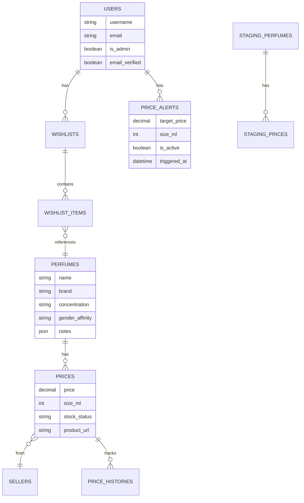

# ScentSeeker - Senior Software Engineer Review

> **Date**: January 3, 2026  
> **Reviewer**: Senior Software Engineer  
> **Branch**: `feature/userfeatures`  
> **Commit**: a82d654

---

## Executive Summary

ScentSeeker is a **perfume price comparison platform** built with Laravel 12.x. The application allows users to discover perfumes, compare prices across multiple sellers, track price history, and receive notifications when prices drop.

### Overall Assessment: **B+ (Strong)**

| Category | Score | Notes |
|----------|-------|-------|
| Architecture | ⭐⭐⭐⭐ | Clean Laravel patterns, good separation |
| Code Quality | ⭐⭐⭐⭐ | Well-structured, consistent formatting |
| Security | ⭐⭐⭐⭐⭐ | Excellent - Sanctum, policies, validation |
| Test Coverage | ⭐⭐⭐⭐ | 57 tests, 133 assertions |
| Performance | ⭐⭐⭐½ | Caching present, some optimization needed |
| Documentation | ⭐⭐⭐ | PRD docs exist, README needs update |

---

## 1. Project Overview

### Tech Stack

| Layer | Technology |
|-------|------------|
| **Backend** | Laravel 12.x (PHP 8.2+) |
| **Database** | MySQL (configurable) |
| **Authentication** | Laravel Sanctum (tokens) |
| **Admin Panel** | Filament 3.x |
| **Frontend** | Blade + Alpine.js + Tailwind CSS |
| **Build** | Vite |
| **Queue** | Database driver |
| **Testing** | PHPUnit 11.x |

### Dependencies (composer.json)

```json
"require": {
    "php": "^8.2",
    "filament/filament": "^3.2",
    "laravel/framework": "^12.0",
    "laravel/sanctum": "^4.1",
    "phpoffice/phpspreadsheet": "^4.3"
}
```

---

## 2. Architecture Analysis

### 2.1 Directory Structure

```
app/
├── Console/Commands/        # 5 commands (CheckPriceAlerts, etc.)
├── Filament/               # Admin panel resources
│   ├── Resources/          # 6 resources (Perfume, Price, Seller, Staging, User)
│   └── Widgets/            # Dashboard widgets
├── Http/Controllers/
│   ├── Api/V1/             # 6 API controllers
│   └── Auth/               # Web auth controllers
├── Jobs/                   # Background jobs
├── Models/                 # 10 Eloquent models
├── Notifications/          # Email notifications
├── Policies/               # 2 authorization policies
├── Providers/              # Service providers
└── Services/
    └── DataIngestion/      # ETL pipeline services
```

### 2.2 Data Model



### 2.3 Core Models Summary

| Model | Purpose | Relationships |
|-------|---------|---------------|
| `User` | Authentication & authorization | hasMany: wishlists, priceAlerts |
| `Perfume` | Fragrance catalog | hasMany: prices |
| `Price` | Current price listing | belongsTo: perfume, seller |
| `Seller` | Retailer/vendor | hasMany: prices |
| `PriceHistory` | Historical price data | belongsTo: price |
| `Wishlist` | User's saved perfumes | hasMany: items, belongsTo: user |
| `WishlistItem` | Perfume in wishlist | belongsTo: wishlist, perfume |
| `PriceAlert` | Price drop notifications | belongsTo: user, perfume |
| `StagingPerfume` | ETL staging table | hasMany: stagingPrices |
| `StagingPrice` | ETL staging table | belongsTo: stagingPerfume |

---

## 3. API Architecture

### 3.1 Route Structure

```
/api/v1/
├── Public Routes
│   ├── POST   /register
│   ├── POST   /login
│   ├── POST   /forgot-password
│   ├── POST   /reset-password
│   ├── GET    /perfumes
│   ├── GET    /perfumes/filters
│   ├── GET    /perfumes/{id}
│   ├── GET    /perfumes/{id}/prices
│   └── GET    /prices/{id}/history
│
└── Authenticated Routes (Sanctum)
    ├── POST   /logout
    ├── POST   /logout-all
    ├── POST   /email/resend
    ├── CRUD   /wishlists
    ├── POST   /wishlist/toggle
    ├── GET    /wishlist/check
    └── CRUD   /price-alerts
```

### 3.2 Rate Limiting

| Endpoint Type | Limit |
|---------------|-------|
| General API | 60/min |
| Auth (login/register) | 10/min |
| Password reset | 6/min |

### 3.3 API Versioning

✅ Good practice: Uses `/api/v1/` prefix for version namespacing.

---

## 4. Security Analysis

### 4.1 Authentication

| Feature | Implementation | Status |
|---------|----------------|--------|
| Token-based auth | Laravel Sanctum | ✅ |
| Password hashing | bcrypt via Hash facade | ✅ |
| Password validation | min 8 chars, confirmation | ✅ |
| Email verification | MustVerifyEmail interface | ✅ |
| Password reset | Laravel Password facade | ✅ |
| Multi-device logout | tokens()->delete() | ✅ |

### 4.2 Authorization

| Resource | Protection Method |
|----------|-------------------|
| Wishlists | WishlistPolicy |
| Price Alerts | PriceAlertPolicy |
| Admin Panel | FilamentUser + is_admin |
| Perfume CRUD | auth:sanctum middleware |

### 4.3 Security Best Practices

✅ **Implemented:**
- CSRF protection on web routes
- Signed URLs for email verification
- Rate limiting on sensitive endpoints
- Request validation before processing
- Policy-based authorization
- Throttling on auth routes

⚠️ **Recommendations:**
1. Add input sanitization for JSON notes field
2. Consider adding API rate limiting per user
3. Add audit logging for admin actions

---

## 5. Code Quality Assessment

### 5.1 Strengths

1. **Consistent Coding Style**
   - PSR-4 autoloading
   - Type hints on method signatures
   - Proper use of return types

2. **Laravel Best Practices**
   - Form Request validation (StorePerfumeRequest, etc.)
   - Resource classes for API responses
   - Policy-based authorization
   - Eloquent relationships properly defined

3. **Clean Controller Methods**
   ```php
   // Good example: PriceAlertController::store()
   - Validates input
   - Checks for duplicates
   - Creates record
   - Returns consistent response
   ```

4. **Well-Organized Services**
   ```
   app/Services/DataIngestion/
   ├── StagingDataService.php      # ETL data handling
   ├── StagingProcessorService.php # Processing logic
   └── Parsers/                    # Format-specific parsers
   ```

### 5.2 Areas for Improvement

1. **Some Controllers Could Be Thinner**
   - `PerfumeController::index()` has 90+ lines
   - Consider extracting filter logic to a service

2. **Caching Strategy Removed**
   - Original caching in PerfumeController was removed
   - Should re-add with cache tags for filtered queries

3. **Missing Interfaces**
   - No repository pattern
   - Services don't implement interfaces

---

## 6. Test Coverage

### 6.1 Test Summary

| Category | Files | Tests | Assertions |
|----------|-------|-------|------------|
| Unit | 2 | 7 | 11 |
| Feature | 7 | 50 | 122 |
| **Total** | **9** | **57** | **133** |

### 6.2 Test Categories

| Test File | Coverage |
|-----------|----------|
| AuthApiTest | Registration, login, logout |
| PerfumeApiTest | CRUD, search, prices |
| WishlistApiTest | CRUD, toggle, check, auth |
| PriceAlertApiTest | CRUD, size support, auth |
| CheckPriceAlertsTest | Trigger logic, notifications |
| StagingProcessorTest | ETL pipeline |

### 6.3 Test Quality

✅ **Good:**
- Uses RefreshDatabase trait
- Tests authentication requirements
- Tests authorization (403 responses)
- Tests edge cases (duplicates, invalid data)

⚠️ **Missing:**
- Browser/E2E tests
- Performance tests
- Integration tests for Filament

---

## 7. Performance Considerations

### 7.1 Database Indexes

```sql
-- Existing indexes
CREATE INDEX perfumes_brand_index ON perfumes(brand);
CREATE INDEX perfumes_name_index ON perfumes(name);
CREATE INDEX prices_perfume_id_index ON prices(perfume_id);
CREATE INDEX prices_seller_id_index ON prices(seller_id);
CREATE INDEX price_alerts_perfume_size_index ON price_alerts(perfume_id, size_ml);
```

### 7.2 Query Optimization

**Concern:** `PerfumeController::index()` filter logic

```php
// Current approach - multiple whereHas calls
$query->whereHas('prices', function ($q) use ($maxPrice) {
    $q->where('price', '<=', $maxPrice);
});
```

**Recommendation:** Consider using a subquery or join for better performance on large datasets.

### 7.3 N+1 Query Prevention

✅ Uses eager loading in most places:
```php
PriceAlert::with(['perfume', 'user'])->active()->get();
```

⚠️ Some views may need additional eager loading verification.

---

## 8. Filament Admin Panel

### 8.1 Resources

| Resource | Features |
|----------|----------|
| PerfumeResource | Full CRUD, form with all fields |
| PriceResource | CRUD with seller relationship |
| SellerResource | Basic CRUD |
| StagingPerfumeResource | Import review, bulk actions |
| StagingPriceResource | Import review |
| UserResource | User management |

### 8.2 Dashboard

- StatsOverview widget with key metrics
- Pending staging items count
- Admin access restricted via `is_admin` flag

### 8.3 Admin Access

```php
// User.php
public function canAccessPanel(Panel $panel): bool
{
    return $this->is_admin === true;
}
```

---

## 9. Data Ingestion Pipeline

### 9.1 Architecture

```
Raw Data → Parsers → Staging Tables → Processor → Production Tables
```

### 9.2 Components

| Component | Size | Purpose |
|-----------|------|---------|
| StagingDataService | 6.7KB | Data handling |
| StagingProcessorService | 24KB | Main processing logic |
| Parsers/ | 4 files | Format-specific parsing |

### 9.3 Staging Workflow

1. **Import**: Raw data parsed into `staging_perfumes` and `staging_prices`
2. **Review**: Admin reviews in Filament panel
3. **Process**: `processStagedData()` moves to production
4. **Deactivation**: Old prices marked inactive

---

## 10. Frontend Architecture

### 10.1 Technology

| Layer | Technology |
|-------|------------|
| Templates | Blade |
| Reactivity | Alpine.js |
| Styling | Tailwind CSS |
| Build | Vite |

### 10.2 Key Pages

| Page | Route | Features |
|------|-------|----------|
| Home | `/` | Welcome/landing |
| Perfumes List | `/perfumes` | Search, filters, pagination |
| Perfume Detail | `/perfumes/{id}` | Prices, alerts, wishlist |
| Wishlist | `/wishlist` | User's saved perfumes |
| Alerts | `/alerts` | Price alert management |
| Admin | `/admin` | Filament panel |

### 10.3 UI Components

- Responsive design with mobile-first approach
- Alpine.js for interactivity (toggles, modals)
- Gradient backgrounds and modern aesthetics
- Heart icon toggle for wishlist
- Price alert modal with size selection

---

## 11. Recommendations

### 11.1 High Priority

| Issue | Recommendation |
|-------|----------------|
| Missing README | Update with project-specific info |
| Caching removed | Re-add with cache tags for filters |
| Large controller | Extract filter logic to service |

### 11.2 Medium Priority

| Issue | Recommendation |
|-------|----------------|
| No E2E tests | Add Dusk or Pest browser tests |
| No API docs | Generate OpenAPI/Swagger docs |
| Queue monitoring | Add Horizon for production |

### 11.3 Low Priority

| Issue | Recommendation |
|-------|----------------|
| No soft deletes | Consider for perfumes/sellers |
| No audit log | Add Spatie Activity Log |
| No search | Consider Laravel Scout for full-text |

---

## 12. Deployment Checklist

### 12.1 Pre-Production

- [ ] Update `.env` for production
- [ ] Set `APP_DEBUG=false`
- [ ] Configure proper mail driver
- [ ] Set up Redis for cache/queue
- [ ] Configure Supervisor for queue worker
- [ ] Set up cron for scheduler

### 12.2 Security

- [ ] Force HTTPS
- [ ] Set secure session cookies
- [ ] Review CORS configuration
- [ ] Audit admin user accounts

### 12.3 Performance

- [ ] Enable OPcache
- [ ] Run `php artisan optimize`
- [ ] Configure CDN for assets
- [ ] Set up database connection pooling

---

## 13. Metrics Summary

| Metric | Value |
|--------|-------|
| **PHP Lines of Code** | 4,321 |
| **Migrations** | 20 |
| **Models** | 10 |
| **Controllers** | 8 |
| **API Endpoints** | ~25 |
| **Tests** | 57 |
| **Test Assertions** | 133 |
| **Filament Resources** | 6 |
| **Views** | ~12 |

---

## 14. Conclusion

ScentSeeker is a **well-architected Laravel application** that follows modern best practices. The codebase demonstrates:

✅ **Strengths:**
- Clean separation of concerns
- Proper authentication and authorization
- Good test coverage
- Modern frontend stack
- Comprehensive admin panel
- Extensible data ingestion pipeline

⚠️ **Areas to Address:**
- Re-implement caching for filtered queries
- Add API documentation
- Update project README
- Consider E2E testing

**Overall Rating: Production-Ready** with minor optimizations recommended.

---

*Review completed by Senior Software Engineer*  
*Date: January 3, 2026*
